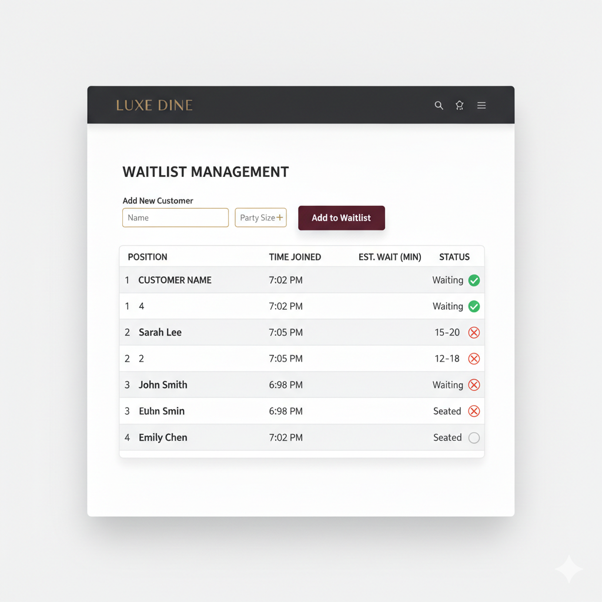
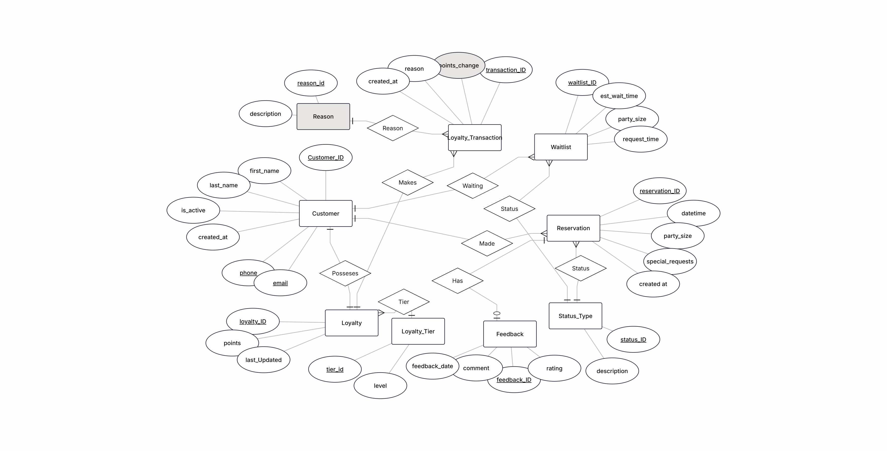
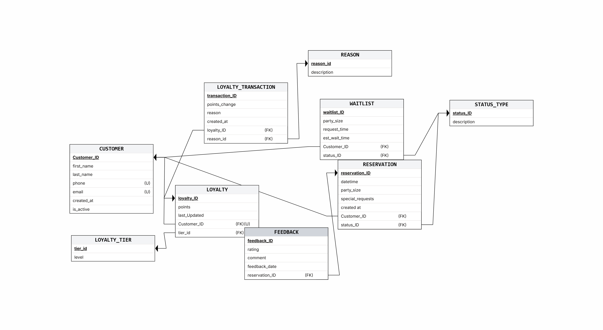
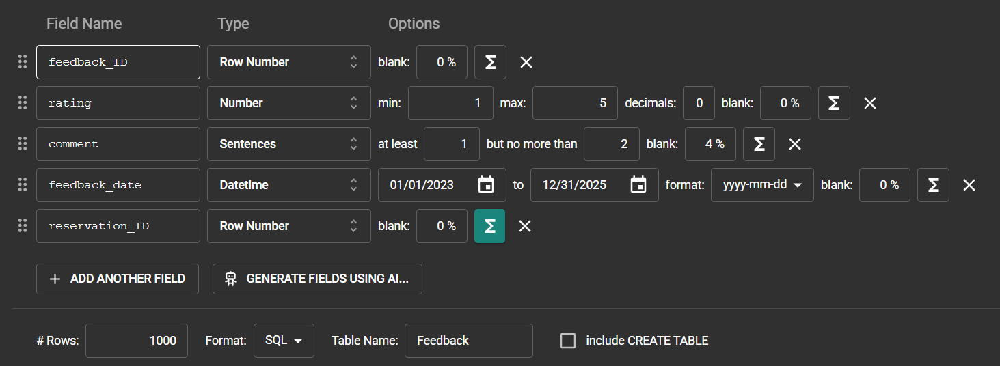
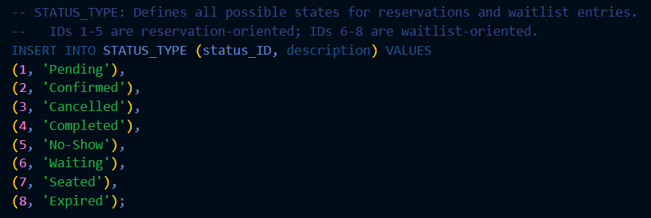
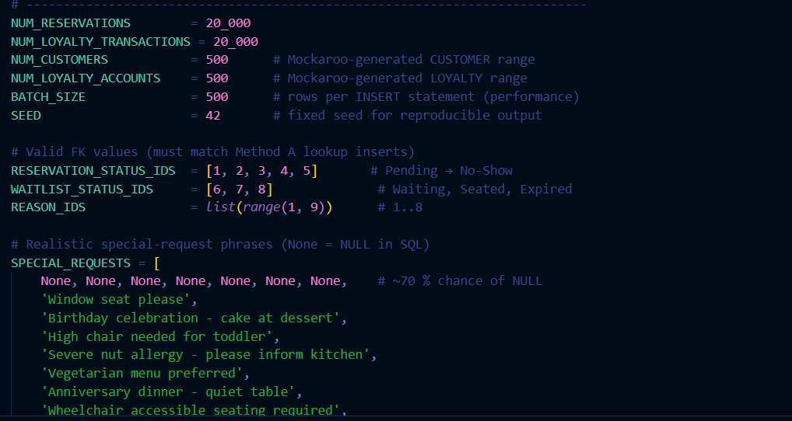
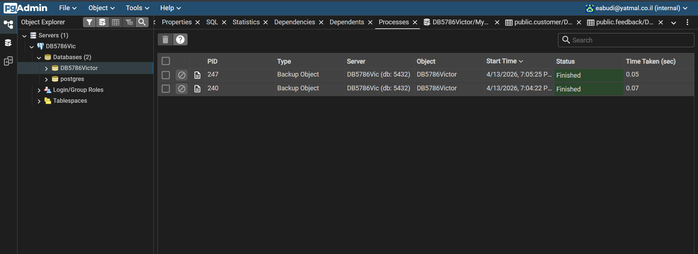
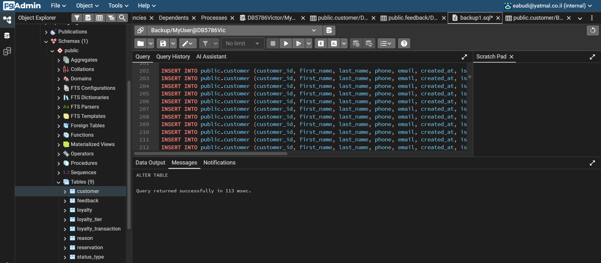
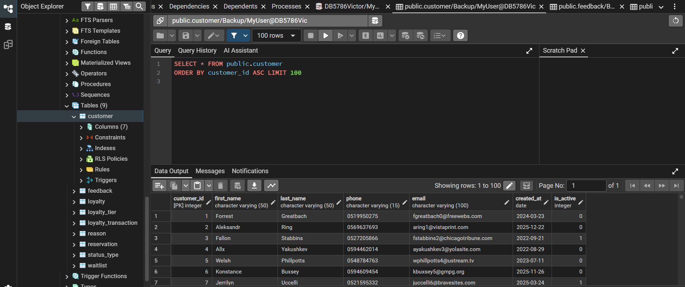

# DB_5786_8100_2119
## אליהו עבודי , אורי מגד

## מערכת מסעדה, מודול שולחנות

## תוכן עניינים

1. [מבוא](#מבוא)
2. [4 מסכים](#4-מסכים)
3. [סכמות מסד נתונים](#סכמות-מסד-נתונים)
4. [מתודולוגיות אכלוס נתונים](#מתודולוגיות-אכלוס-נתונים)
5. [גיבוי ושחזור נתונים](#גיבוי-ושחזור-נתונים)

## מבוא

ארכיטקטורת מסד נתונים יחסית (Relational Database) זו מתוכננת לרכז ולנהל את נתוני התפעול הליבתיים של מסעדה מודרנית. המערכת מתעדת נתונים בלתי משתנים אודות זהויות לקוחות, הזמנות סעודה כרונולוגיות, רשימות המתנה דינמיות ללקוחות מזדמנים, משוב סעודה איכותני, ופנקס תגמולי נאמנות מדורג. 

הפונקציונליות המרכזית מבטיחה כי הנהלת המסעדה תוכל לעקוב באופן רציף אחר מחזור החיים של הלקוח — החל מהזמנת שולחן ועד לצבירת נקודות נאמנות מבוססות עסקאות — תוך אכיפה קפדנית של שלמות כרונולוגית ואילוצים מתמטיים למניעת אנומליות בנתונים.

## 4 מסכים

## מסך הזמנות

## מסך רשימת המתנה

## מסך נאמנות

## מסך משוב

## סכמות מסד נתונים

## תרשים ישויות-קשרים (ERD)

## סכמת מסד נתונים (DSD)

## מתודולוגיות אכלוס נתונים

## Mockaroo

## הכנסה ידנית (Manual Insert)

## סקריפט Python

## גיבוי ושחזור נתונים

