# DB_5786_8100_2119
## Eliyahu Aboody, Ori Meged

## Restaurant System — Tables Module

## Table of Contents

1. [Introduction](#introduction)
2. [4 Screens](#4-screens)
3. [Database Schemas](#database-schemas)
4. [Data Population Methodologies](#data-population-methodologies)
5. [Data Backup and Recovery](#data-backup-and-recovery)
6. [Phase B — Dual SELECT Queries (S1–S4)](#phase-b--dual-select-queries-s1s4)
7. [Phase B — Additional SELECT Queries (S5–S8)](#phase-b--additional-select-queries-s5s8)
8. [Phase B — DELETE Queries](#phase-b--delete-queries)
9. [Phase B — UPDATE Queries](#phase-b--update-queries)
10. [Phase B — Constraints](#phase-b--constraints)
11. [Phase B — Rollback and Commit](#phase-b--rollback-and-commit)
12. [Phase B — Indexes](#phase-b--indexes)
13. [Phase C — Integration Between Systems (Customer DB & Orders DB)](#phase-c--integration-between-systems-customer-db--orders-db)
14. [Phase D — Programming (PL/pgSQL Programming)](#phase-d--programming-plpgsql-programming)
15. [Phase E — Management Application (Web Application)](#phase-e--management-application-web-application)

---

## Introduction

This Relational Database architecture is designed to centralize and manage the core operational data of a modern restaurant. The system records immutable data about customer identities, chronological dining reservations, dynamic waitlists for walk-in customers, qualitative dining feedback, and a tiered loyalty rewards ledger.

The core functionality ensures that restaurant management can continuously track the customer lifecycle — from table booking to transaction-based loyalty point accumulation — while strictly enforcing chronological integrity and mathematical constraints to prevent data anomalies.

## 4 Screens

## Reservations Screen

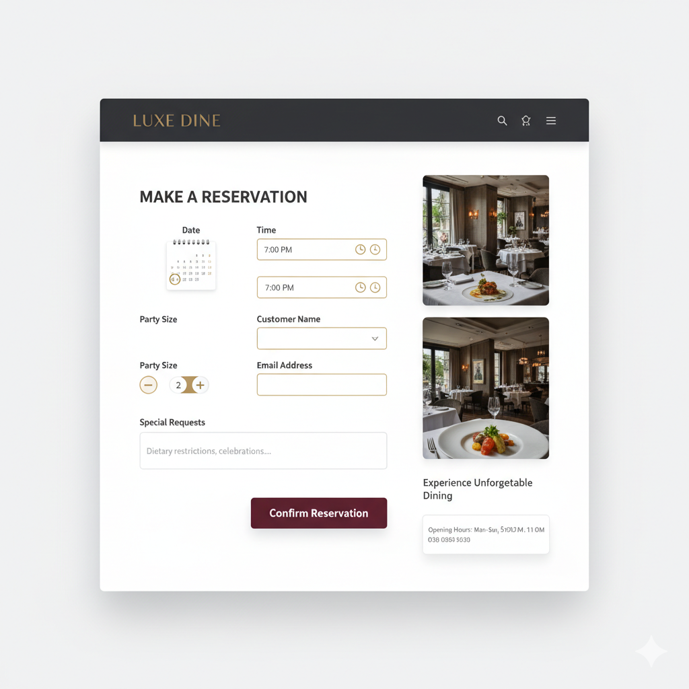

## Waitlist Screen

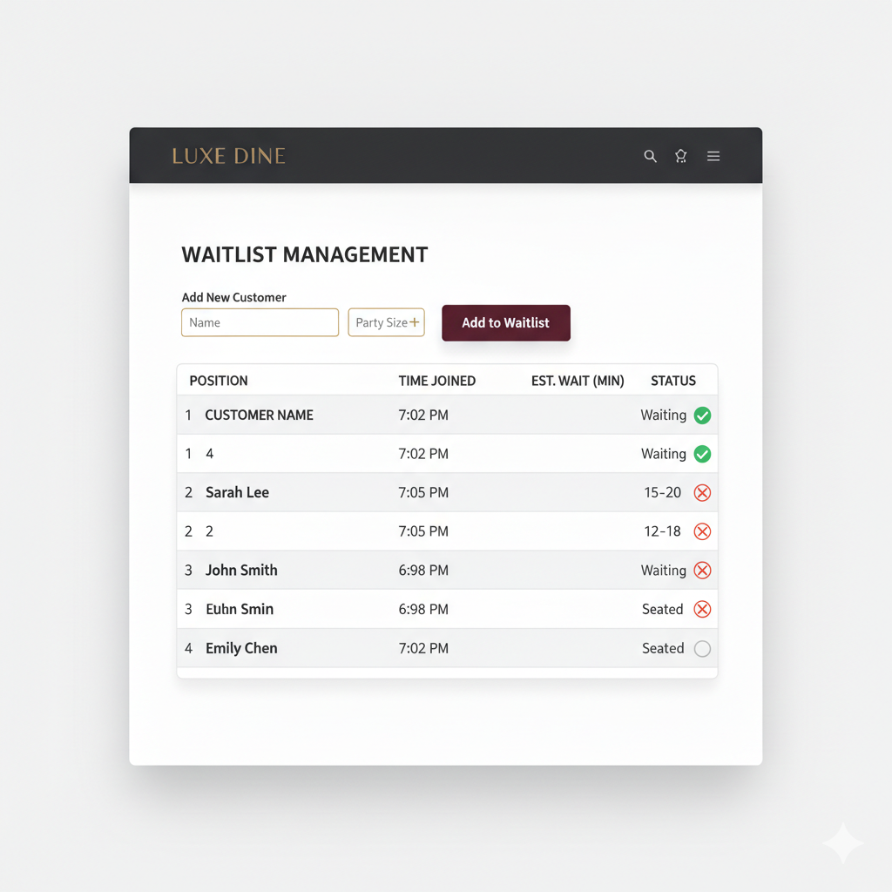

## Loyalty Screen

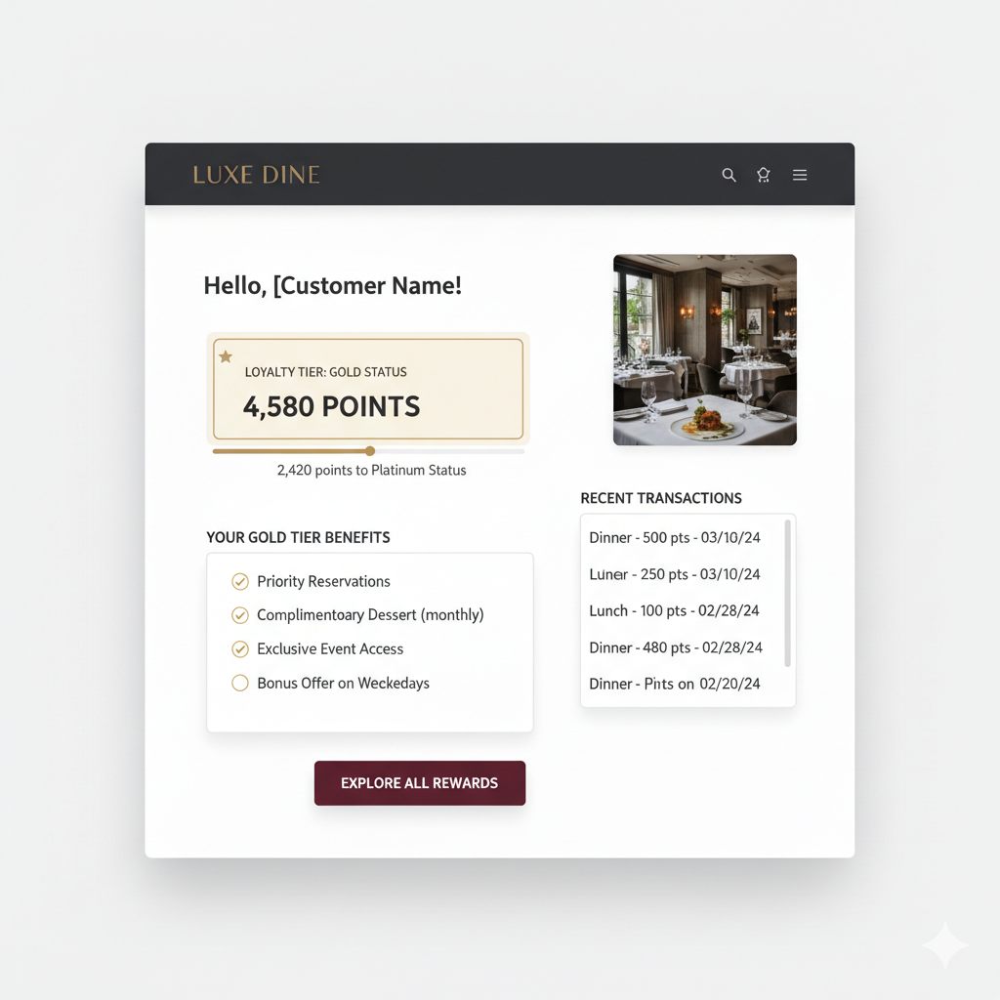

## Feedback Screen


## Database Schemas

## Entity-Relationship Diagram (ERD)

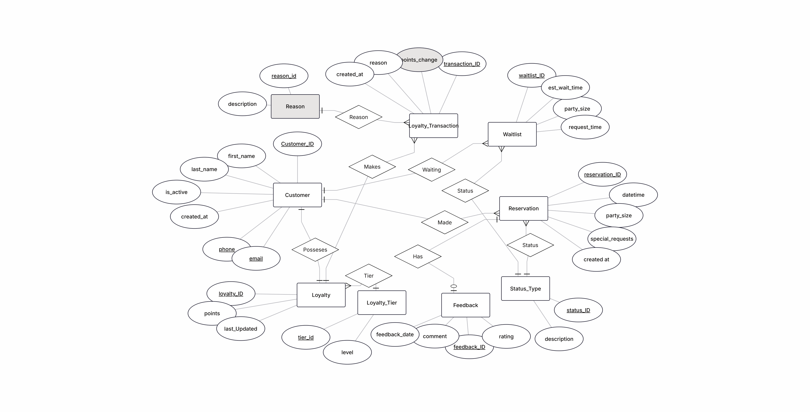

## Database Schema Diagram (DSD)

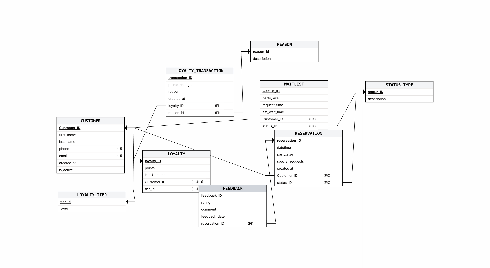

## Data Population Methodologies

## Mockaroo

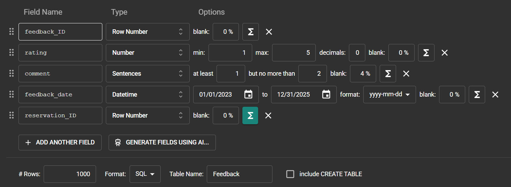

## Manual Insert

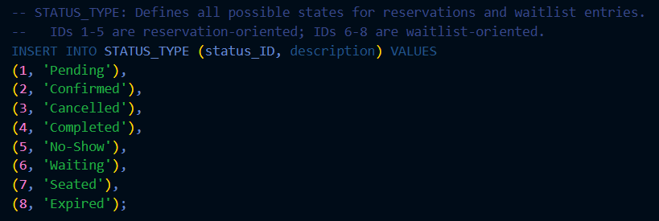

## Python Script

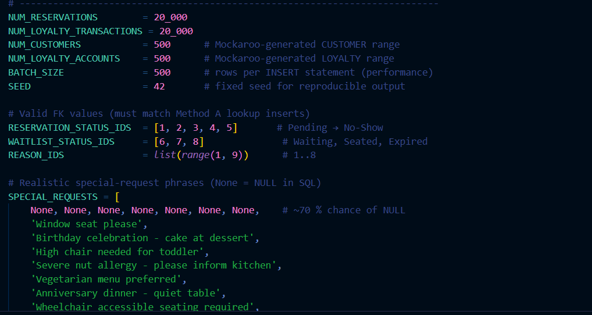

## Data Backup and Recovery

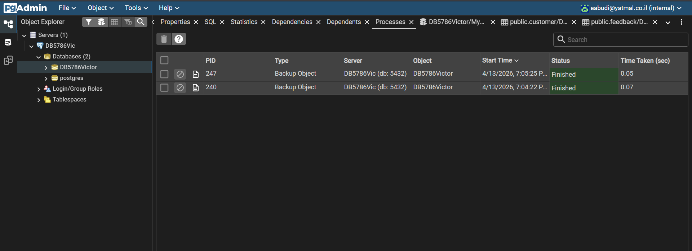

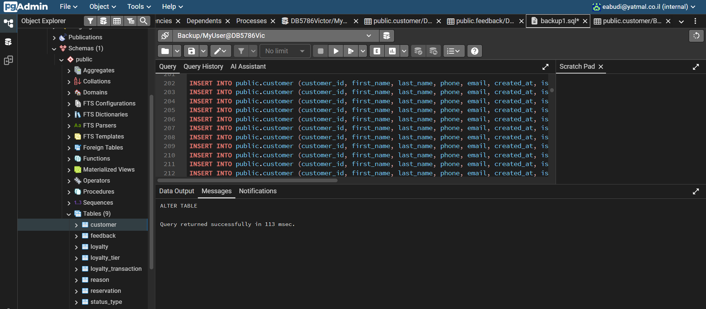

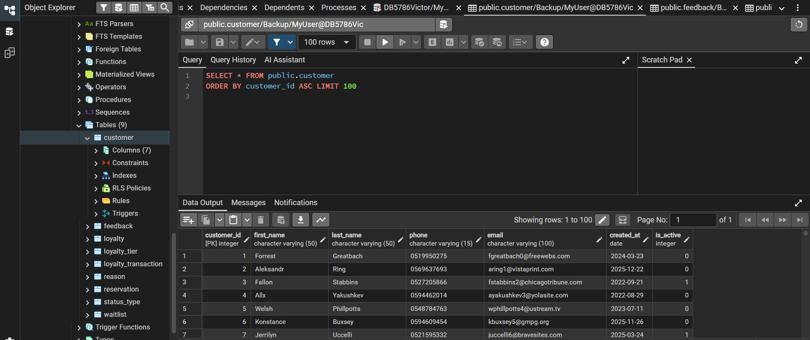

---

# Phase B — Queries, Constraints, Transactions, and Indexes Report

---

## Phase B — Dual SELECT Queries (S1–S4)

For each of the following 4 queries, two writing forms are presented (Form A and Form B), including an explanation of the difference between them and which is more efficient.

---

### S1 — Monthly Reservation Volume Report

**Description:** This query displays the total number of reservations by month and year, including average party size, total guests, and the number of reservations that were completed, cancelled, or marked as No-Show. The query is used by the reservations management screen and the management dashboard for staffing planning.

**Form A — JOIN with GROUP BY (more efficient):**

```sql
SELECT
    EXTRACT(YEAR FROM r.datetime)   AS reservation_year,
    EXTRACT(MONTH FROM r.datetime)  AS reservation_month,
    COUNT(*)                        AS total_reservations,
    ROUND(AVG(r.party_size), 1)     AS avg_party_size,
    SUM(r.party_size)               AS total_guests,
    COUNT(CASE WHEN st.description = 'Completed' THEN 1 END) AS completed_count,
    COUNT(CASE WHEN st.description = 'Cancelled' THEN 1 END) AS cancelled_count,
    COUNT(CASE WHEN st.description = 'No-Show'   THEN 1 END) AS noshow_count
FROM RESERVATION r
JOIN STATUS_TYPE st ON r.status_ID = st.status_ID
GROUP BY
    EXTRACT(YEAR FROM r.datetime),
    EXTRACT(MONTH FROM r.datetime)
ORDER BY reservation_year DESC, reservation_month DESC;
```

**Execution Screenshot:**


**Result Screenshot:**


---

**Form B — Correlated Subqueries in SELECT (less efficient):**

```sql
SELECT
    r_agg.reservation_year,
    r_agg.reservation_month,
    r_agg.total_reservations,
    r_agg.avg_party_size,
    r_agg.total_guests,
    (SELECT COUNT(*)
     FROM RESERVATION r2
     WHERE r2.status_ID = (SELECT status_ID FROM STATUS_TYPE WHERE description = 'Completed')
       AND EXTRACT(YEAR FROM r2.datetime)  = r_agg.reservation_year
       AND EXTRACT(MONTH FROM r2.datetime) = r_agg.reservation_month
    ) AS completed_count,
    (SELECT COUNT(*)
     FROM RESERVATION r2
     WHERE r2.status_ID = (SELECT status_ID FROM STATUS_TYPE WHERE description = 'Cancelled')
       AND EXTRACT(YEAR FROM r2.datetime)  = r_agg.reservation_year
       AND EXTRACT(MONTH FROM r2.datetime) = r_agg.reservation_month
    ) AS cancelled_count
FROM (
    SELECT
        EXTRACT(YEAR FROM r.datetime)   AS reservation_year,
        EXTRACT(MONTH FROM r.datetime)  AS reservation_month,
        COUNT(*)                        AS total_reservations,
        ROUND(AVG(r.party_size), 1)     AS avg_party_size,
        SUM(r.party_size)               AS total_guests
    FROM RESERVATION r
    GROUP BY
        EXTRACT(YEAR FROM r.datetime),
        EXTRACT(MONTH FROM r.datetime)
) r_agg
ORDER BY reservation_year DESC, reservation_month DESC;
```

**Execution Screenshot:**


**Result Screenshot:**


**Difference and Efficiency:**

Form A performs a single scan of the RESERVATION table with a JOIN to STATUS_TYPE and performs all aggregations (COUNT, AVG, SUM) in a single pass. Form B, by contrast, uses correlated subqueries (Correlated Subqueries) in SELECT — for each result row (each month/year), an additional scan of the RESERVATION table is performed. This means N separate scans compared to a single scan in Form A, making **Form A significantly more efficient**, especially with large data volumes.

---

### S2 — Top 10 Customers by Reservations and Loyalty

**Description:** This query identifies the most active customers in the system, including their number of reservations, average feedback rating, loyalty points, and tier level. The query powers the loyalty screen and the personalized customer greeting.

**Form A — JOIN-based (more efficient):**

```sql
SELECT
    c.Customer_ID,
    c.first_name || ' ' || c.last_name    AS full_name,
    c.email,
    COUNT(DISTINCT r.reservation_ID)       AS total_reservations,
    COALESCE(ROUND(AVG(f.rating), 2), 0)   AS avg_rating,
    l.points                               AS loyalty_points,
    lt.level                               AS loyalty_tier
FROM CUSTOMER c
JOIN RESERVATION r   ON c.Customer_ID = r.Customer_ID
LEFT JOIN FEEDBACK f ON r.reservation_ID = f.reservation_ID
JOIN LOYALTY l       ON c.Customer_ID = l.Customer_ID
JOIN LOYALTY_TIER lt ON l.tier_id = lt.tier_id
WHERE c.is_active = 1
GROUP BY c.Customer_ID, c.first_name, c.last_name, c.email,
         l.points, lt.level
ORDER BY total_reservations DESC, avg_rating DESC
LIMIT 10;
```

**Execution Screenshot:**


**Result Screenshot:**


---

**Form B — Correlated Subqueries (less efficient):**

```sql
SELECT
    c.Customer_ID,
    c.first_name || ' ' || c.last_name    AS full_name,
    c.email,
    (SELECT COUNT(*)
     FROM RESERVATION r
     WHERE r.Customer_ID = c.Customer_ID
    ) AS total_reservations,
    COALESCE(
      (SELECT ROUND(AVG(f.rating), 2)
       FROM FEEDBACK f
       JOIN RESERVATION r ON f.reservation_ID = r.reservation_ID
       WHERE r.Customer_ID = c.Customer_ID
      ), 0
    ) AS avg_rating,
    l.points           AS loyalty_points,
    lt.level           AS loyalty_tier
FROM CUSTOMER c
JOIN LOYALTY l       ON c.Customer_ID = l.Customer_ID
JOIN LOYALTY_TIER lt ON l.tier_id = lt.tier_id
WHERE c.is_active = 1
ORDER BY total_reservations DESC, avg_rating DESC
LIMIT 10;
```

**Execution Screenshot:**


**Result Screenshot:**


**Difference and Efficiency:**

Form A executes a single execution plan that joins all 5 tables in one pass, allowing the DB engine to use Hash Join or Merge Join. Form B runs 2 separate correlated subqueries (reservation count + average rating) for **each customer row** — with 500 customers, this can result in ~1000 additional scans. **Form A is more efficient** because it avoids repeated scans.

---

### S3 — Active Waitlist with Customer Details

**Description:** This query powers the waitlist management screen and displays customers on the waitlist who also have a loyalty account, sorted by request time. Displayed fields: position, customer name, party size, join time, estimated wait time, status, and loyalty tier.

**Form A — Using IN (better readability):**

```sql
SELECT
    w.waitlist_ID                        AS position,
    c.first_name || ' ' || c.last_name   AS customer_name,
    w.party_size,
    w.request_time                       AS time_joined,
    w.est_wait_time                      AS est_wait_min,
    st.description                       AS status,
    COALESCE(lt.level, 'No Loyalty')     AS loyalty_tier
FROM WAITLIST w
JOIN CUSTOMER c    ON w.Customer_ID = c.Customer_ID
JOIN STATUS_TYPE st ON w.status_ID = st.status_ID
LEFT JOIN LOYALTY l  ON c.Customer_ID = l.Customer_ID
LEFT JOIN LOYALTY_TIER lt ON l.tier_id = lt.tier_id
WHERE w.Customer_ID IN (
    SELECT Customer_ID FROM CUSTOMER WHERE is_active = 1
)
AND EXTRACT(YEAR FROM w.request_time) >= 2024
ORDER BY w.request_time ASC;
```

**Execution Screenshot:**


**Result Screenshot:**


---

**Form B — Using EXISTS (more efficient for large datasets):**

```sql
SELECT
    w.waitlist_ID                        AS position,
    c.first_name || ' ' || c.last_name   AS customer_name,
    w.party_size,
    w.request_time                       AS time_joined,
    w.est_wait_time                      AS est_wait_min,
    st.description                       AS status,
    COALESCE(lt.level, 'No Loyalty')     AS loyalty_tier
FROM WAITLIST w
JOIN CUSTOMER c    ON w.Customer_ID = c.Customer_ID
JOIN STATUS_TYPE st ON w.status_ID = st.status_ID
LEFT JOIN LOYALTY l  ON c.Customer_ID = l.Customer_ID
LEFT JOIN LOYALTY_TIER lt ON l.tier_id = lt.tier_id
WHERE EXISTS (
    SELECT 1 FROM CUSTOMER c2
    WHERE c2.Customer_ID = w.Customer_ID AND c2.is_active = 1
)
AND EXTRACT(YEAR FROM w.request_time) >= 2024
ORDER BY w.request_time ASC;
```

**Execution Screenshot:**


**Result Screenshot:**


**Difference and Efficiency:**

Form A uses IN, which materializes the list of active Customer_IDs and then filters. Form B uses EXISTS, which operates on a "Short-Circuit" principle — it stops scanning the inner query as soon as it finds the first match for the current row, while IN must materialize all results of the inner query. **Form B (EXISTS) is more efficient** when the inner table is large, because it doesn't need to build a full list in memory.

---

### S4 — Loyalty Points Activity by Reason and Quarter

**Description:** This query breaks down loyalty point transactions by transaction reason and calendar quarter, displaying summaries and counts. The query powers the "Recent Transactions" panel on the loyalty screen. Includes segmentation by year and quarter using EXTRACT.

**Form A — JOIN with GROUP BY (more efficient):**

```sql
SELECT
    EXTRACT(YEAR FROM lt.created_at)      AS transaction_year,
    EXTRACT(QUARTER FROM lt.created_at)   AS transaction_quarter,
    rn.description                        AS reason,
    COUNT(*)                              AS transaction_count,
    SUM(lt.points_change)                 AS total_points,
    ROUND(AVG(lt.points_change), 1)       AS avg_points_per_txn
FROM LOYALTY_TRANSACTION lt
JOIN REASON rn  ON lt.reason_id = rn.reason_id
JOIN LOYALTY l  ON lt.loyalty_ID = l.loyalty_ID
GROUP BY
    EXTRACT(YEAR FROM lt.created_at),
    EXTRACT(QUARTER FROM lt.created_at),
    rn.description
HAVING COUNT(*) > 5
ORDER BY transaction_year DESC, transaction_quarter DESC, total_points DESC;
```

**Execution Screenshot:**


**Result Screenshot:**


---

**Form B — Nested Subquery with WHERE IN (less efficient):**

```sql
SELECT
    EXTRACT(YEAR FROM lt.created_at)      AS transaction_year,
    EXTRACT(QUARTER FROM lt.created_at)   AS transaction_quarter,
    (SELECT rn.description FROM REASON rn WHERE rn.reason_id = lt.reason_id) AS reason,
    COUNT(*)                              AS transaction_count,
    SUM(lt.points_change)                 AS total_points,
    ROUND(AVG(lt.points_change), 1)       AS avg_points_per_txn
FROM LOYALTY_TRANSACTION lt
WHERE lt.reason_id IN (
    SELECT reason_id FROM REASON
)
GROUP BY
    EXTRACT(YEAR FROM lt.created_at),
    EXTRACT(QUARTER FROM lt.created_at),
    lt.reason_id
HAVING COUNT(*) > 5
ORDER BY transaction_year DESC, transaction_quarter DESC, total_points DESC;
```

**Execution Screenshot:**


**Result Screenshot:**


**Difference and Efficiency:**

Form A performs a single scan of LOYALTY_TRANSACTION with JOINs to REASON and LOYALTY, grouping and aggregating in a single pass. Form B first filters LOYALTY_TRANSACTION by reason name (requiring a JOIN to REASON), then the outer query scans and aggregates again. Additionally, the subquery in SELECT (`SELECT rn.description...`) is executed for each result row. This two-step approach is slower than Form A's single pass. **Form A is more efficient.**

---

## Phase B — Additional SELECT Queries (S5–S8)

---

### S5 — Average Feedback Rating by Day of Week

**Description:** This query shows which days of the week receive the best and worst ratings from customers, helping optimize staffing and service quality. Includes: review count, average rating, lowest/highest rating, and count of positive and negative reviews.

```sql
SELECT
    CASE EXTRACT(DOW FROM r.datetime)
        WHEN 0 THEN 'Sunday'
        WHEN 1 THEN 'Monday'
        WHEN 2 THEN 'Tuesday'
        WHEN 3 THEN 'Wednesday'
        WHEN 4 THEN 'Thursday'
        WHEN 5 THEN 'Friday'
        WHEN 6 THEN 'Saturday'
    END                                   AS day_of_week,
    COUNT(f.feedback_ID)                  AS total_reviews,
    ROUND(AVG(f.rating), 2)              AS avg_rating,
    MIN(f.rating)                         AS lowest_rating,
    MAX(f.rating)                         AS highest_rating,
    COUNT(CASE WHEN f.rating >= 4 THEN 1 END) AS positive_reviews,
    COUNT(CASE WHEN f.rating <= 2 THEN 1 END) AS negative_reviews
FROM FEEDBACK f
JOIN RESERVATION r ON f.reservation_ID = r.reservation_ID
JOIN CUSTOMER c    ON r.Customer_ID = c.Customer_ID
GROUP BY EXTRACT(DOW FROM r.datetime)
ORDER BY avg_rating DESC;
```

**Execution Screenshot:**


**Result Screenshot:**


---

### S6 — Completed Reservations Without Feedback

**Description:** This query identifies reservations that have been completed but have not yet received feedback, so the restaurant team can send review request emails. Uses LEFT JOIN with IS NULL to find missing records.

```sql
SELECT
    r.reservation_ID,
    c.first_name || ' ' || c.last_name    AS customer_name,
    c.email,
    r.datetime                            AS reservation_date,
    EXTRACT(MONTH FROM r.datetime)        AS reservation_month,
    EXTRACT(YEAR FROM r.datetime)         AS reservation_year,
    r.party_size,
    st.description                        AS status
FROM RESERVATION r
JOIN CUSTOMER c     ON r.Customer_ID = c.Customer_ID
JOIN STATUS_TYPE st ON r.status_ID = st.status_ID
LEFT JOIN FEEDBACK f ON r.reservation_ID = f.reservation_ID
WHERE f.feedback_ID IS NULL
  AND st.description = 'Completed'
ORDER BY r.datetime DESC
LIMIT 50;
```

**Execution Screenshot:**


**Result Screenshot:**


---

### S7 — Full Customer Profile with Loyalty Transactions

**Description:** For a given customer (Customer_ID = 1), the query displays their recent loyalty transactions including: reason, date breakdown (day, month, year), current points, current tier, and points distance to the next tier. The query powers the "Recent Transactions" list on the loyalty screen.

```sql
SELECT
    c.first_name || ' ' || c.last_name              AS customer_name,
    lt_tier.level                                    AS current_tier,
    l.points                                         AS current_points,
    CASE
        WHEN lt_tier.level = 'Bronze'   THEN 2501 - l.points
        WHEN lt_tier.level = 'Silver'   THEN 5001 - l.points
        WHEN lt_tier.level = 'Gold'     THEN 7501 - l.points
        WHEN lt_tier.level = 'Platinum' THEN 0
    END                                              AS points_to_next_tier,
    rn.description                                   AS transaction_reason,
    lt_txn.points_change,
    EXTRACT(DAY FROM lt_txn.created_at)              AS txn_day,
    EXTRACT(MONTH FROM lt_txn.created_at)            AS txn_month,
    EXTRACT(YEAR FROM lt_txn.created_at)             AS txn_year
FROM CUSTOMER c
JOIN LOYALTY l           ON c.Customer_ID = l.Customer_ID
JOIN LOYALTY_TIER lt_tier ON l.tier_id = lt_tier.tier_id
JOIN LOYALTY_TRANSACTION lt_txn ON l.loyalty_ID = lt_txn.loyalty_ID
JOIN REASON rn           ON lt_txn.reason_id = rn.reason_id
WHERE c.Customer_ID = 1
ORDER BY lt_txn.created_at DESC
LIMIT 20;
```

**Execution Screenshot:**


**Result Screenshot:**


---

### S8 — Ranking the Busiest Months (Seasonal Trends)

**Description:** The query ranks months by total guests served across all years, revealing seasonal patterns for capacity planning. The query uses the RANK() window function to rank months within each year.

```sql
SELECT
    EXTRACT(YEAR FROM r.datetime)            AS res_year,
    EXTRACT(MONTH FROM r.datetime)           AS res_month,
    COUNT(r.reservation_ID)                  AS total_reservations,
    SUM(r.party_size)                        AS total_guests,
    ROUND(AVG(r.party_size), 1)              AS avg_party_size,
    RANK() OVER (
        PARTITION BY EXTRACT(YEAR FROM r.datetime)
        ORDER BY SUM(r.party_size) DESC
    )                                        AS month_rank_by_guests
FROM RESERVATION r
JOIN STATUS_TYPE st ON r.status_ID = st.status_ID
WHERE st.description IN ('Confirmed', 'Completed')
GROUP BY
    EXTRACT(YEAR FROM r.datetime),
    EXTRACT(MONTH FROM r.datetime)
ORDER BY res_year DESC, month_rank_by_guests ASC;
```

**Execution Screenshot:**


**Result Screenshot:**


---

## Phase B — DELETE Queries

---

### D1 — Delete Expired Waitlist Records (Over One Year Old)

**Description:** Deletes waitlist records with 'Expired' status that are more than one year old. Keeps the waitlist table lean and efficient.

```sql
DELETE FROM WAITLIST
WHERE status_ID = (SELECT status_ID FROM STATUS_TYPE WHERE description = 'Expired')
  AND request_time < CURRENT_DATE - INTERVAL '1 year';
```

**Database state before deletion:**


**Execution Screenshot:**


**Database state after deletion:**


---

### D2 — Delete Cancelled Reservations Older Than Two Years

**Description:** First deletes feedback linked to cancelled reservations older than two years, then deletes the reservations themselves. Respects Foreign Key constraints by deleting child records first.

```sql
-- Step 1: Delete feedback linked to old cancelled reservations
DELETE FROM FEEDBACK
WHERE reservation_ID IN (
    SELECT r.reservation_ID
    FROM RESERVATION r
    JOIN STATUS_TYPE st ON r.status_ID = st.status_ID
    WHERE st.description = 'Cancelled'
      AND r.datetime < CURRENT_DATE - INTERVAL '2 years'
);

-- Step 2: Delete the old cancelled reservations themselves
DELETE FROM RESERVATION
WHERE status_ID = (SELECT status_ID FROM STATUS_TYPE WHERE description = 'Cancelled')
  AND datetime < CURRENT_DATE - INTERVAL '2 years';
```

**Database state before deletion:**


**Execution Screenshot:**


**Database state after deletion:**


---

### D3 — Delete Loyalty Transactions for Inactive Customers with Zero Points

**Description:** Removes loyalty transaction records for customers who have been deactivated (is_active = 0) and have zero points. These records are no longer operationally relevant.

```sql
DELETE FROM LOYALTY_TRANSACTION
WHERE loyalty_ID IN (
    SELECT l.loyalty_ID
    FROM LOYALTY l
    JOIN CUSTOMER c ON l.Customer_ID = c.Customer_ID
    WHERE c.is_active = 0
      AND l.points = 0
);
```

**Database state before deletion:**


**Execution Screenshot:**


**Database state after deletion:**


---

## Phase B — UPDATE Queries

---

### U1 — Automatic Loyalty Tier Upgrade Based on Points

**Description:** Automatically updates each customer's loyalty tier based on their current point balance: Bronze (0–2500), Silver (2501–5000), Gold (5001–7500), Platinum (7501+).

```sql
UPDATE LOYALTY
SET tier_id = CASE
    WHEN points <= 2500 THEN (SELECT tier_id FROM LOYALTY_TIER WHERE level = 'Bronze')
    WHEN points <= 5000 THEN (SELECT tier_id FROM LOYALTY_TIER WHERE level = 'Silver')
    WHEN points <= 7500 THEN (SELECT tier_id FROM LOYALTY_TIER WHERE level = 'Gold')
    ELSE                     (SELECT tier_id FROM LOYALTY_TIER WHERE level = 'Platinum')
END,
last_Updated = CURRENT_DATE;
```

**Database state before update:**


**Execution Screenshot:**


**Database state after update:**


---

### U2 — Mark Past Confirmed Reservations as Completed

**Description:** Automatically updates reservations whose date has already passed and are still marked 'Confirmed' to 'Completed' status.

```sql
UPDATE RESERVATION
SET status_ID = (SELECT status_ID FROM STATUS_TYPE WHERE description = 'Completed')
WHERE datetime < CURRENT_DATE
  AND status_ID = (SELECT status_ID FROM STATUS_TYPE WHERE description = 'Confirmed');
```

**Database state before update:**


**Execution Screenshot:**


**Database state after update:**


---

### U3 — Deactivate Inactive Customers (No Reservation for Over Two Years)

**Description:** Sets is_active = 0 for customers who have not made a reservation in over two years. Uses a NOT EXISTS subquery to check for recent activity.

```sql
UPDATE CUSTOMER
SET is_active = 0
WHERE is_active = 1
  AND NOT EXISTS (
    SELECT 1
    FROM RESERVATION r
    WHERE r.Customer_ID = CUSTOMER.Customer_ID
      AND r.datetime >= CURRENT_DATE - INTERVAL '2 years'
  );
```

**Database state before update:**


**Execution Screenshot:**


**Database state after update:**


---

## Phase B — Constraints

---

### Constraint 1 — Reservation Date Must Be After Creation Date

**Description of change:** Added a CHECK constraint on the RESERVATION table ensuring that the planned dining date (datetime) must be equal to or later than the reservation creation date (created_at). This prevents creating reservations for dates that have already passed relative to the moment of creation.

```sql
ALTER TABLE RESERVATION
ADD CONSTRAINT chk_reservation_future_date
CHECK (datetime >= created_at);
```

**Attempt to insert conflicting data (and execution error):**

```sql
-- Attempt to create a reservation with datetime before created_at — expected to fail
INSERT INTO RESERVATION (reservation_ID, Customer_ID, status_ID, party_size, datetime, created_at)
VALUES (99999, 1, 1, 4, '2023-01-01 12:00:00', '2025-06-01 10:00:00');
```


---

### Constraint 2 — Feedback Comment Must Be Meaningful (At Least 4 Characters)

**Description of change:** Added a CHECK constraint on the FEEDBACK table ensuring that if a customer leaves a comment, it must contain at least 4 characters (after trimming whitespace). Comments like "Ok", "No", or single-letter typos are rejected. NULL is allowed (the customer is not required to leave a comment).

```sql
ALTER TABLE FEEDBACK
ADD CONSTRAINT chk_meaningful_comment
CHECK (comment IS NULL OR LENGTH(TRIM(comment)) >= 4);
```

**Attempt to insert conflicting data (and execution error):**

```sql
-- Attempt to insert feedback with a comment that is too short — expected to fail
INSERT INTO FEEDBACK (feedback_ID, reservation_ID, rating, comment, feedback_date)
VALUES (99999, 1, 5, 'Ok', CURRENT_DATE);
```


---

### Constraint 3 — First Name and Last Name Cannot Be Identical

**Description of change:** Added a CHECK constraint on the CUSTOMER table ensuring that a customer's first name and last name cannot be the same (compared case-insensitively). Such a situation usually indicates a data entry error (e.g., "John John").

```sql
ALTER TABLE CUSTOMER
ADD CONSTRAINT chk_names_different
CHECK (LOWER(first_name) <> LOWER(last_name));
```

**Attempt to insert conflicting data (and execution error):**

```sql
-- Attempt to insert a customer with identical first and last name — expected to fail
INSERT INTO CUSTOMER (Customer_ID, first_name, last_name, phone, email, created_at, is_active)
VALUES (99999, 'John', 'John', '0501234567', 'john@example.com', CURRENT_DATE, 1);
```


---

## Phase B — Rollback and Commit

---

### Example 1: ROLLBACK — Loyalty Points Update and Reverting the Change

**Scenario:** A manager accidentally adds 9999 points to customer 1's loyalty account. We will show the change, then perform a ROLLBACK to undo it.

**Step 1 — BEFORE state (before the change):**

```sql
SELECT c.first_name || ' ' || c.last_name AS customer_name, l.points, lt.level AS tier
FROM CUSTOMER c
JOIN LOYALTY l       ON c.Customer_ID = l.Customer_ID
JOIN LOYALTY_TIER lt ON l.tier_id = lt.tier_id
WHERE c.Customer_ID = 1;
```


**Step 2 — Open transaction and perform UPDATE:**

```sql
BEGIN;

UPDATE LOYALTY
SET points = 9999, last_Updated = CURRENT_DATE
WHERE Customer_ID = 1;
```

**Step 3 — AFTER state (after the update, before Rollback):**

```sql
SELECT c.first_name || ' ' || c.last_name AS customer_name, l.points, lt.level AS tier
FROM CUSTOMER c
JOIN LOYALTY l       ON c.Customer_ID = l.Customer_ID
JOIN LOYALTY_TIER lt ON l.tier_id = lt.tier_id
WHERE c.Customer_ID = 1;
```


**Step 4 — Perform ROLLBACK:**

```sql
ROLLBACK;
```

**Step 5 — RESTORED state (after the rollback):**

```sql
SELECT c.first_name || ' ' || c.last_name AS customer_name, l.points, lt.level AS tier
FROM CUSTOMER c
JOIN LOYALTY l       ON c.Customer_ID = l.Customer_ID
JOIN LOYALTY_TIER lt ON l.tier_id = lt.tier_id
WHERE c.Customer_ID = 1;
```


---

### Example 2: COMMIT — Reservation Status Update and Saving the Change

**Scenario:** A host confirms a pending reservation (ID = 1). We will update the status to 'Confirmed', perform a COMMIT, and verify that the change is saved.

**Step 1 — BEFORE state (before the change):**

```sql
SELECT r.reservation_ID, c.first_name || ' ' || c.last_name AS customer_name,
       r.datetime, r.party_size, st.description AS status
FROM RESERVATION r
JOIN CUSTOMER c     ON r.Customer_ID = c.Customer_ID
JOIN STATUS_TYPE st ON r.status_ID = st.status_ID
WHERE r.reservation_ID = 1;
```


**Step 2 — Open transaction and perform UPDATE:**

```sql
BEGIN;


UPDATE RESERVATION
SET status_ID = (SELECT status_ID FROM STATUS_TYPE WHERE description = 'Confirmed')
WHERE reservation_ID = 1;
```

**Step 3 — AFTER state (after the update, before Commit):**

```sql
SELECT r.reservation_ID, c.first_name || ' ' || c.last_name AS customer_name,
       r.datetime, r.party_size, st.description AS status
FROM RESERVATION r
JOIN CUSTOMER c     ON r.Customer_ID = c.Customer_ID
JOIN STATUS_TYPE st ON r.status_ID = st.status_ID
WHERE r.reservation_ID = 1;
```


**Step 4 — Perform COMMIT:**

```sql
COMMIT;
```

**Step 5 — FINAL state (after the Commit — change is permanent):**

```sql
SELECT r.reservation_ID, c.first_name || ' ' || c.last_name AS customer_name,
       r.datetime, r.party_size, st.description AS status
FROM RESERVATION r
JOIN CUSTOMER c     ON r.Customer_ID = c.Customer_ID
JOIN STATUS_TYPE st ON r.status_ID = st.status_ID
WHERE r.reservation_ID = 1;
```


---

## Phase B — Indexes

---

### Index 1 — `idx_reservation_customer` on RESERVATION(Customer_ID)

**Description:** Many SELECT queries (S1, S2, S3, S6, S7, S8) perform JOINs between RESERVATION and CUSTOMER. An index on Customer_ID accelerates the matching lookups.

```sql
CREATE INDEX IF NOT EXISTS idx_reservation_customer
ON RESERVATION (Customer_ID);
```

**Execution time before adding the index:**


**Execution time after adding the index:**


---

### Index 2 — `idx_reservation_datetime` on RESERVATION(datetime)

**Description:** Queries S1, S6, S8, and U2 all filter or group by reservation date (datetime). An index on this column improves the performance of GROUP BY and range scans.

```sql
CREATE INDEX IF NOT EXISTS idx_reservation_datetime
ON RESERVATION (datetime);
```

**Execution time before adding the index:**


**Execution time after adding the index:**


---

### Index 3 — `idx_loyalty_txn_created` on LOYALTY_TRANSACTION(created_at)

**Description:** Query S4 groups by EXTRACT(YEAR/QUARTER) from created_at. An index on this column accelerates the date-based aggregation.

```sql
CREATE INDEX IF NOT EXISTS idx_loyalty_txn_created
ON LOYALTY_TRANSACTION (created_at);
```

**Execution time before adding the index:**


**Execution time after adding the index:**


---

### Explanation of Index Results

Indexes impact performance by allowing the database engine to access relevant rows directly instead of performing a **Full Table Scan**. Without an index, the DB engine must iterate over every row in the table to find matches. With an index, it uses a **B-Tree** data structure that enables logarithmic search (O(log n)) instead of linear (O(n)).

Specifically:
- **Index on Customer_ID:** Accelerates JOIN operations because the DB can locate all reservations for a specific customer without scanning the entire table.
- **Index on datetime:** Accelerates queries with date range filtering and GROUP BY, because the data is already sorted in the index.
- **Index on created_at:** Accelerates date extraction (EXTRACT) in GROUP BY, because the DB can scan the index in chronological order.

> **Note:** The improvement becomes more significant as the table grows larger. With ~40,000+ records, the difference in execution times is noticeable.

---

# Phase C — Integration Between Systems (Customer DB & Orders DB)

## DSD and ERD Diagrams
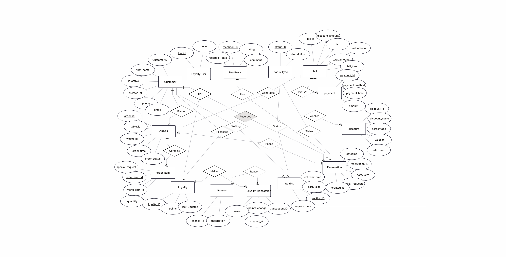
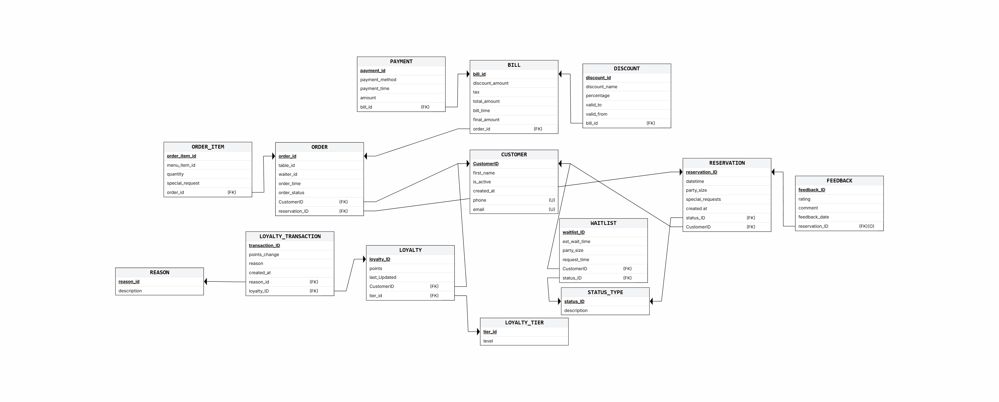

## Decisions Made During the Integration Phase
1. **Using Foreign Data Wrapper (FDW):** Instead of merging the databases into one and breaking the microservices architecture, it was decided to use FDW, which allows queries in the customer database to access data in the orders database remotely.
2. **Least Privilege Permission Model:** It was decided to create a dedicated read-only user (`customer_team_reader`) in the orders database. This user was granted permission only to non-sensitive columns (e.g., the `tax` column is hidden from the customer-side view).
3. **Soft Key and Soft Deletes:** Since a physical Foreign Key cannot be enforced between separate databases, a logical relationship was defined between `customer_id` in the ORDER table and the CUSTOMER table. To ensure data integrity, a "soft delete" mechanism was added using a trigger that updates the `deleted_at` column and prevents physical deletion of customers, thus preventing the creation of orphan records.
4. **Backfill:** Orphaned orders were found in the orders database that had no corresponding customer. It was decided to create an automatic script that populates "dummy" customer data to fix historical data integrity.

## Verbal Explanation of the Process and Commands
The integration process was divided into several steps saved in the `Integrate.sql` file:

1. **Defining the Connection:** Running commands in the customer database to configure the orders server as a remote target:
```sql
CREATE EXTENSION IF NOT EXISTS postgres_fdw;

CREATE SERVER orders_server
FOREIGN DATA WRAPPER postgres_fdw
OPTIONS (host 'db2', port '5432', dbname 'Orders_db2');
```

2. **Importing Schemas:** Importing tables from the orders database into a new schema in the customer database:
```sql
CREATE SCHEMA IF NOT EXISTS remote_orders;

IMPORT FOREIGN SCHEMA public
FROM SERVER orders_server INTO remote_orders;
```

3. **Security:** Running specific read permissions in the orders database, then configuring user mappings in the customer database:
**In the Orders Database (Provider):**
```sql
CREATE USER customer_team_reader WITH PASSWORD 'reader_pass';
GRANT USAGE ON SCHEMA public TO customer_team_reader;
GRANT SELECT (order_id, table_id, customer_id, order_time, order_status) ON "ORDER" TO customer_team_reader;
GRANT SELECT (bill_id, order_id, final_amount, bill_time) ON bill TO customer_team_reader;
```
**In the Customer Database (Consumer):**
```sql
CREATE USER MAPPING FOR "MyUser"
SERVER orders_server
OPTIONS (user 'customer_team_reader', password 'reader_pass');
```

4. **Soft Delete Trigger:** Adding a `deleted_at` column to the customer table and activating a trigger function that prevents physical deletion and prevents orphaned orders:
```sql
ALTER TABLE customer ADD COLUMN IF NOT EXISTS deleted_at TIMESTAMP NULL;

CREATE OR REPLACE FUNCTION soft_delete_customer()
RETURNS TRIGGER AS $$
BEGIN
    UPDATE customer 
    SET deleted_at = CURRENT_TIMESTAMP, is_active = 0 
    WHERE customer_id = OLD.customer_id;
    RETURN NULL;
END;
$$ LANGUAGE plpgsql;

DROP TRIGGER IF EXISTS trigger_soft_delete_customer ON customer;
CREATE TRIGGER trigger_soft_delete_customer
BEFORE DELETE ON customer
FOR EACH ROW EXECUTE FUNCTION soft_delete_customer();
```

## Views and Queries

### View 1: Customer Loyalty Summary (from the perspective of the original customer department)
**Description:** A view connecting the `customer` table to the `loyalty` table (two local tables in the customer database). Displays customer contact details along with their active status, total points, and tier.
**View creation code:**
```sql
CREATE OR REPLACE VIEW v_customer_loyalty_summary AS
SELECT 
    c.customer_id,
    c.first_name,
    c.last_name,
    c.email,
    l.points,
    l.tier_id,
    c.is_active
FROM customer c
JOIN loyalty l ON c.customer_id = l.customer_id;
```
**Data retrieval:**
```sql
SELECT * FROM v_customer_loyalty_summary LIMIT 10;
```
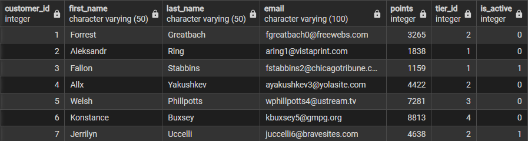

#### Query 1.1: Find Active Customers with Over 100 Points
**Description:** Filters the view to display only customers who are active and have accumulated more than 100 loyalty points.
**Query code:**
```sql
SELECT first_name, last_name, points 
FROM v_customer_loyalty_summary 
WHERE points > 100 AND is_active = 1;
```
**Output:** Displays a list of names and points.
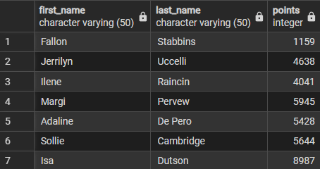

#### Query 1.2: Calculate Average Points by Tier
**Description:** Performs a GROUP BY on the view to calculate the average points in each loyalty tier (tier_id).
**Query code:**
```sql
SELECT tier_id, AVG(points) as avg_points 
FROM v_customer_loyalty_summary 
GROUP BY tier_id 
ORDER BY tier_id;
```
**Output:** Displays tier ID and average points.
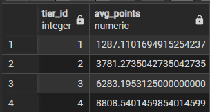

---

### View 2: Order Billing Summary (from the perspective of the orders department)
**Description:** A view connecting the `ORDER` table to the `bill` table (both from the orders database). Provides a summary of order status, total payment, discounts, and final amount due.
**View creation code:**
```sql
CREATE OR REPLACE VIEW v_order_billing_summary AS
SELECT 
    o.order_id,
    o.order_status,
    o.order_time,
    b.total_amount,
    b.discount_amount,
    b.final_amount
FROM "ORDER" o
JOIN bill b ON o.order_id = b.order_id;

```
**Data retrieval:**
```sql
SELECT * FROM v_order_billing_summary LIMIT 10;
```
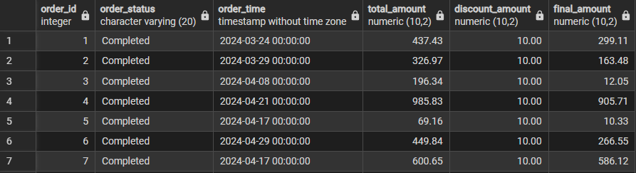

#### Query 2.1: Average Final Amount for Completed Orders
**Description:** Applies an aggregate function on the view to find the average revenue per order among those that were successfully completed.
**Query code:**
```sql
SELECT AVG(final_amount) as avg_completed_amount 
FROM v_order_billing_summary 
WHERE order_status = 'Completed';
```
**Output:** Displays a monetary average value.
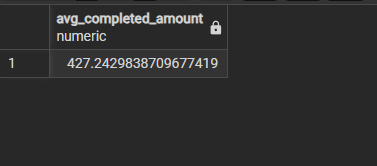


#### Query 2.2: Find Orders with Discounts
**Description:** Filters the view to display only orders where the discount amount (discount_amount) is greater than zero.
**Query code:**
```sql
SELECT order_id, total_amount, discount_amount, final_amount 
FROM v_order_billing_summary 
WHERE discount_amount > 0;
```
**Output:** Displays full billing details for discounted orders.

---

### View 3: Customer Order History (Cross-Departmental Integration)
**Description:** A view demonstrating the successful integration! It connects the `customer` table (from the customer database) with the `remote_orders."ORDER"` table (from the remote orders database via FDW). Displays which customers placed which orders in real time.
**View creation code:**
```sql
CREATE OR REPLACE VIEW v_cross_db_customer_orders AS
SELECT 
    c.customer_id,
    c.first_name,
    c.last_name,
    o.order_id,
    o.order_status,
    o.order_time
FROM customer c
JOIN remote_orders."ORDER" o ON c.customer_id = o.customer_id;
```
**Data retrieval:**
```sql
SELECT * FROM v_cross_db_customer_orders LIMIT 10;
```
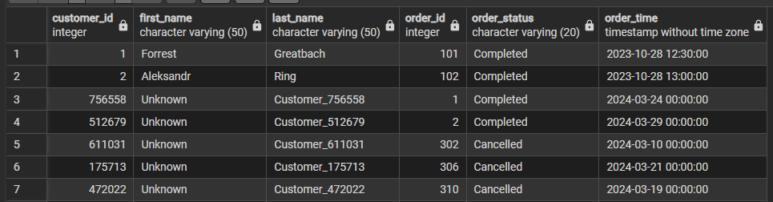

#### Query 3.1: Count Orders per Customer
**Description:** Performs a GROUP BY based on customer name and counts how many orders exist under their name in the remote orders system.
**Query code:**
```sql
SELECT first_name, last_name, COUNT(order_id) as total_orders 
FROM v_cross_db_customer_orders 
GROUP BY first_name, last_name 
ORDER BY total_orders DESC;
```
**Output:** Displays a list of customers and their total orders.
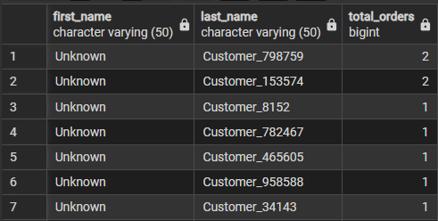

#### Query 3.2: Find Customers with Cancelled Orders
**Description:** Retrieves from the view the names of customers whose order status in the remote system has been set to 'Cancelled'. Uses DISTINCT to prevent duplicates.
**Query code:**
```sql
SELECT DISTINCT first_name, last_name 
FROM v_cross_db_customer_orders 
WHERE order_status = 'Cancelled';
```
**Output:** Displays customer names that have cancellations.

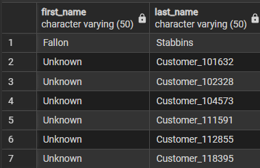

---

# Phase D — Programming (PL/pgSQL Programming)

In this phase we practice writing PL/pgSQL programs on our database tables. The programs are non-trivial and include functions, procedures, triggers, and main routines.

Below is a detailed breakdown of the two main programs (Main Programs) developed in this phase:

### Main Program 1: Daily Maintenance Routine

**Routine Description:**
This routine is used to perform daily maintenance operations on the customer and loyalty system. It performs two main operations:
1. **Calculating Average Feedback Score:** It invokes the `fn_calculate_avg_feedback_score(p_customer_id)` function for customer number 1, which dynamically calculates the average of the scores the customer has given in their feedback using an explicit parameterized cursor.
2. **Processing and Awarding Loyalty Rewards:** It invokes the `pr_process_loyalty_rewards()` procedure, which scans active customers using a cursor and identifies customers who have made more than 3 reservations but accumulated fewer than 500 points. These customers are upgraded by 100 bonus points and the transaction is recorded in the transaction history table.

**Main Program Code (`Maintenance_Routine.sql`):**
```sql
DO $$ 
DECLARE
    v_avg_score NUMERIC;
BEGIN
    RAISE NOTICE 'Starting Daily Maintenance Job...';
    
    -- Call Function 2
    v_avg_score := fn_calculate_avg_feedback_score(1);
    RAISE NOTICE 'Customer 1 Avg Feedback Score: %', v_avg_score;
    
    -- Call Procedure 1
    CALL pr_process_loyalty_rewards();
    RAISE NOTICE 'Loyalty rewards processed successfully.';
    
EXCEPTION
    WHEN OTHERS THEN
        RAISE EXCEPTION 'Maintenance Job Failed: %', SQLERRM;
END $$;
```

---

### Main Program 2: Reporting and Queue Clearing Routine

**Routine Description:**
This routine is designed to run periodically for generating integrative reports and handling expired waitlist records. It performs two main operations:
1. **Handling Expired Queues:** It invokes the `pr_resolve_stale_waitlist()` procedure, which locates waitlist records whose status is "Waiting" and have been waiting for more than two hours. The procedure transitions their status to "Expired" and compensates customers with 50 loyalty points as compensation for the extended wait.
2. **Generating a Cross-Database Order Report (Integrative):** It invokes the `fn_get_customer_remote_orders(p_customer_id)` function, which returns a reference cursor (`REFCURSOR`) pointing to the list of orders for the customer from the remote database (`Orders_DB`) via FDW. The main program opens the cursor within the transaction, loops through the results, prints the details of each order and its final amount, and closes the cursor in a controlled manner.

**Main Program Code (`Reporting_Routine.sql`):**
```sql
DO $$ 
DECLARE
    v_refcursor refcursor;
    v_order_record RECORD;
BEGIN
    RAISE NOTICE 'Starting Customer Report Generation...';
    
    -- Call Procedure 2
    CALL pr_resolve_stale_waitlist();
    RAISE NOTICE 'Stale waitlists resolved.';
    
    -- Architecture Note: Strict transaction boundary maintained for Ref Cursor
    -- Call Function 1
    v_refcursor := fn_get_customer_remote_orders(1);
    
    RAISE NOTICE 'Remote Orders for Customer 1:';
    LOOP
        FETCH v_refcursor INTO v_order_record;
        EXIT WHEN NOT FOUND;
        
        RAISE NOTICE 'Order ID: %, Status: %, Final Amount: %', 
                     v_order_record.order_id, 
                     v_order_record.order_status, 
                     v_order_record.final_amount;
    END LOOP;
    
    CLOSE v_refcursor;
    
EXCEPTION
    WHEN OTHERS THEN
        RAISE EXCEPTION 'Report Generation Failed: %', SQLERRM;
END $$;
```

---

## Phase E — Management Application (Web Application)

### Setup Instructions

1. **Prerequisites** — Install the required packages:
   ```bash
   pip install flask psycopg2-binary
   ```

2. **Database Configuration** — Make sure PostgreSQL is running and the connection details in `db.py` are correct (host, port, dbname, user, password).

3. **Running the Application** — Run from the `Phase E` directory:
   ```bash
   python app.py
   ```

4. **Accessing the System** — Open a browser at `http://localhost:5000`  
   Username: `admin` | Password: `admin`

---

### Tools Used to Build the Application

| Tool | Role |
|------|------|
| **Python 3** | Primary programming language |
| **Flask** | Web framework for building the server and routing |
| **psycopg2** | Python ↔ PostgreSQL connection |
| **Jinja2** | HTML template engine (built into Flask) |
| **HTML / CSS / JavaScript** | User interface — design and interactivity |
| **PostgreSQL** | Relational database |

---

### Application Screenshots

## Login Screen

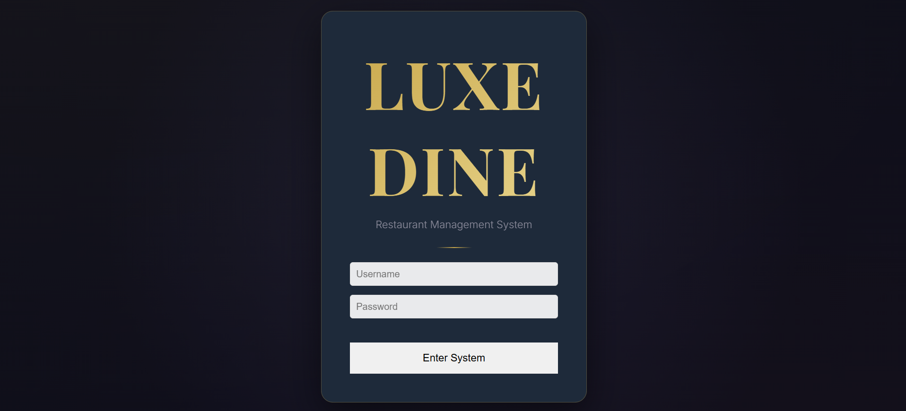

## Dashboard and Queries

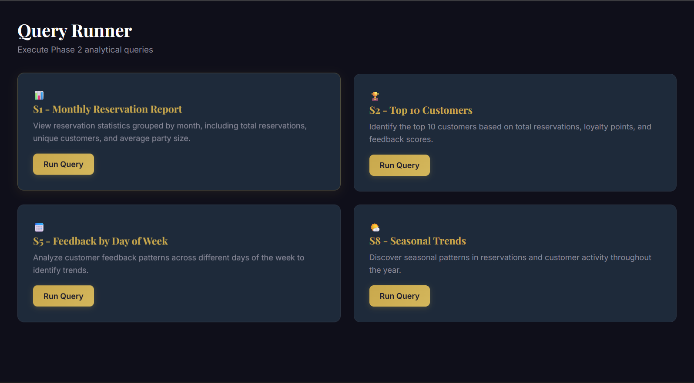

## Running a Query

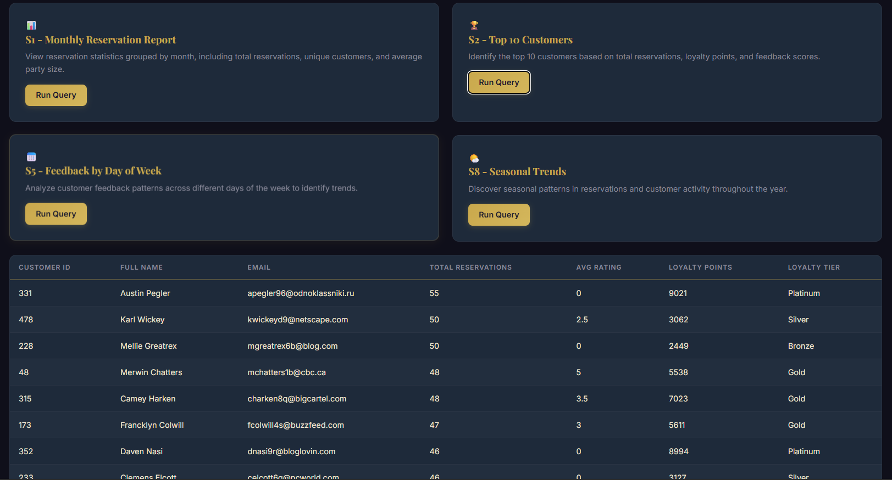

## Procedures and Functions

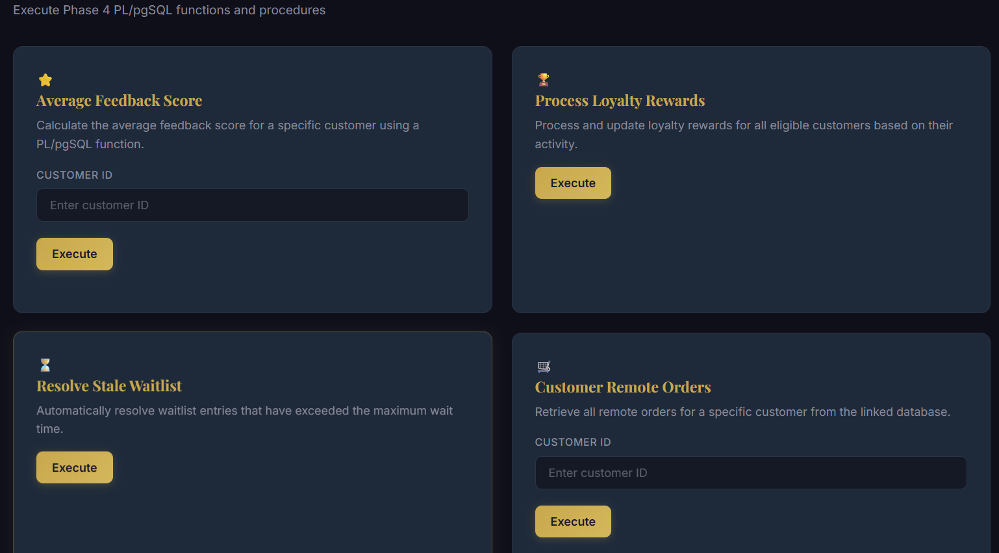

## Feedback Score

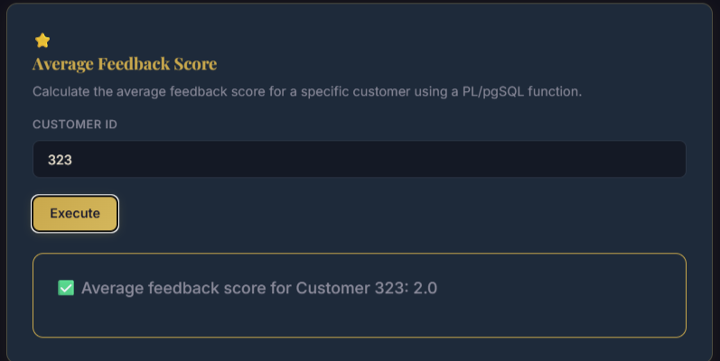

## CRUD Interface — Add and Edit

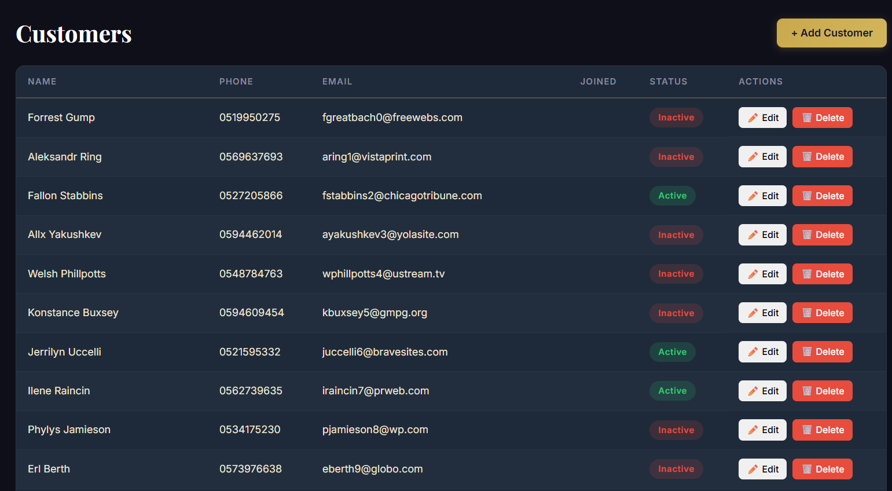

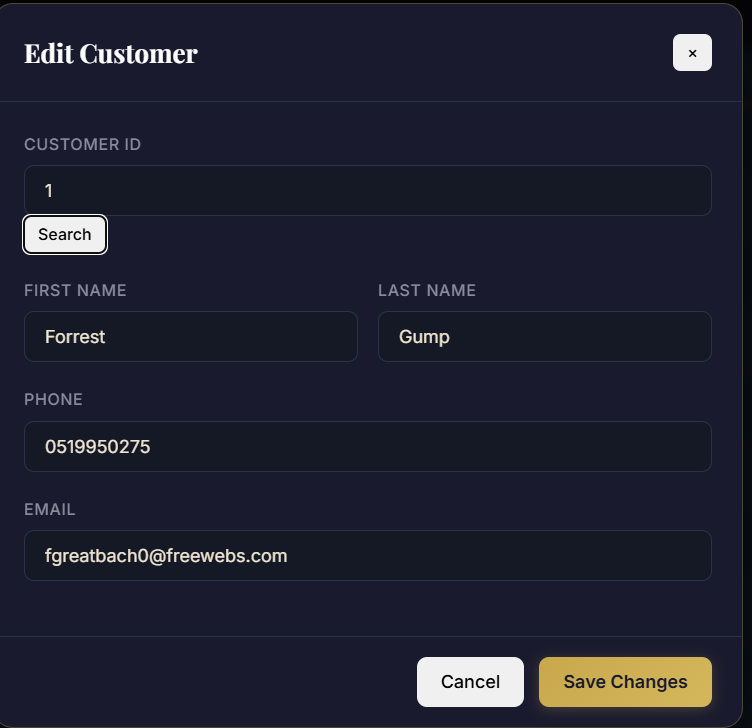
